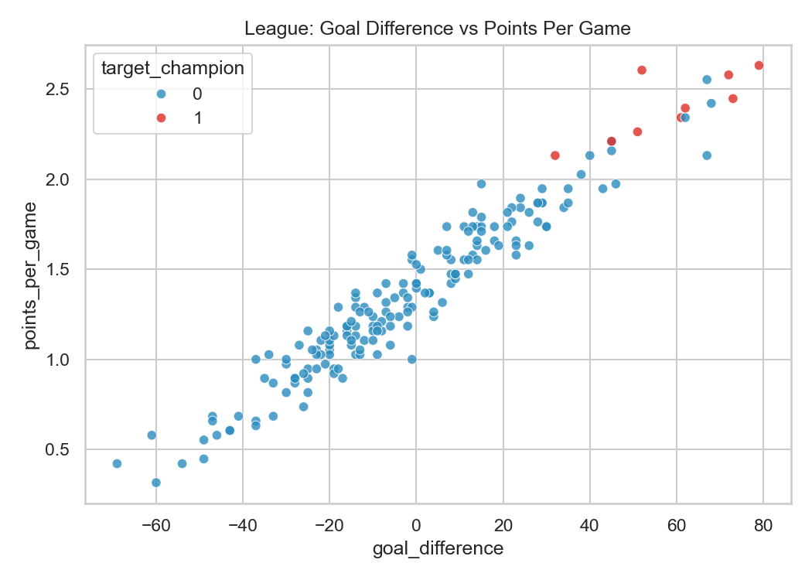
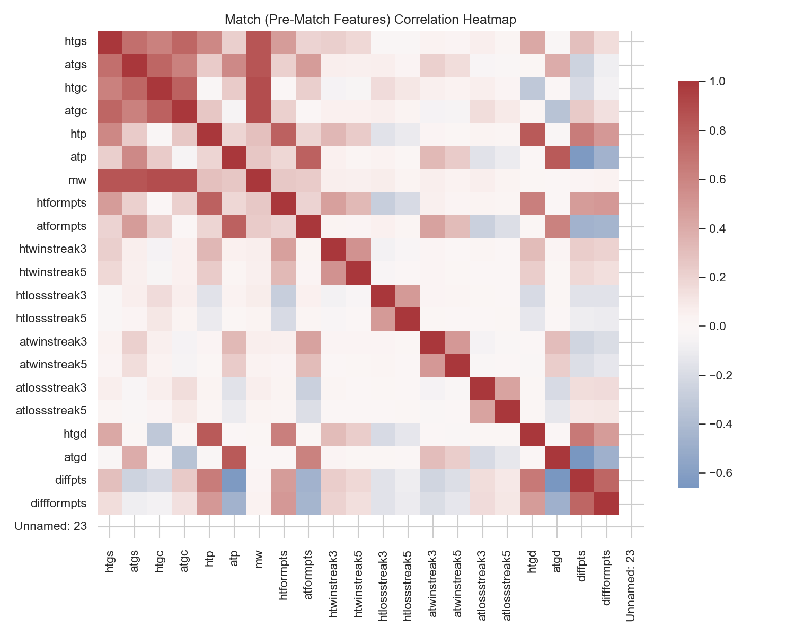
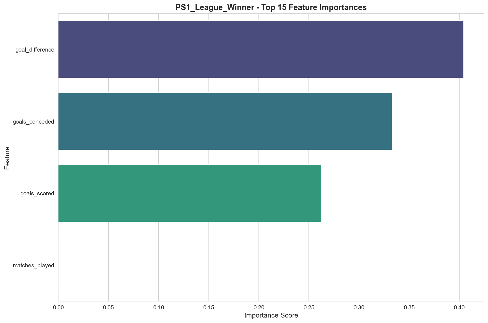

# ScoreSight - EPL Prediction Project

**Author:** Prathamesh Fuke  
**Branch:** Prathamesh_Fuke  
**Repository:** https://github.com/prathameshfuke/scoresight.git

## Project Overview

ScoreSight is a machine learning project focused on predicting English Premier League (EPL) outcomes using historical match data, player statistics, and team performance metrics.

### Prediction Objectives
1. **Match Outcomes** - Predict match scores and winners
2. **Top Scorer** - Identify the season's leading goal scorer
3. **League Winner & Points Tally** - Forecast team points and champion

## Visualizations

Here are some key insights and model performance metrics from the project:

### 1. League Insights
**Goal Difference vs Points Per Game**


### 2. Feature Analysis
**Pre-match Feature Correlations**


### 3. Model Performance
**League Winner Feature Importance**


**Match Winner Confusion Matrix**


## Project Structure

The project is organized into two main sections:

### 1. Final_Project (Production-Ready Code)
This directory contains the polished, production-ready components of the project.

*   **Backend_Code/**: Contains the core machine learning pipelines and trained models.
    *   `League_Winner_Pipeline.ipynb`: Pipeline for predicting the league champion.
    *   `Match_Winner_Pipeline.ipynb`: Pipeline for predicting match outcomes (Home/Draw/Away).
    *   `TopScorer_TotalPoints.ipynb`: Pipeline for predicting top scorers and team total points.
    *   `models/`: Directory containing the trained `.joblib` models and metadata.
*   **Frontend_Code/**: Contains the Streamlit web application.
    *   `main.py`: The entry point for the web app.
    *   `pages/`: Contains the individual prediction pages.
    *   `utils/`: Helper functions for UI and data loading.
    *   `image/`: Images and logos used in the app.
*   **Model_Deployment_Link.txt**: Contains the URL to the live deployment of the application.

### 2. Task_Files (Development & Experimental)
This directory contains all the development work, data processing, and experimental notebooks.

*   **notebooks/**: Contains data loading, cleaning, EDA, and experimental training notebooks (01-08, etc.).
*   **data/**: Contains all data files (raw, cleaned, features, etc.).
*   **datasets/**: Original raw datasets.
*   **visualizations/**: Generated charts and plots.
*   **docs/**: Project documentation and reports.

```
ScoreSight/
├── Final_Project/
│   ├── Backend_Code/
│   │   ├── League_Winner_Pipeline.ipynb
│   │   ├── Match_Winner_Pipeline.ipynb
│   │   ├── TopScorer_TotalPoints.ipynb
│   │   └── models/
│   ├── Frontend_Code/
│   │   ├── main.py
│   │   ├── pages/
│   │   ├── utils/
│   │   └── image/
│   └── Model_Deployment_Link.txt
├── Task_Files/
│   ├── notebooks/
│   ├── data/
│   ├── datasets/
│   ├── visualizations/
│   └── docs/
├── requirements.txt
├── README.md
└── LICENSE
```

## Datasets

### 1. Match Winner.csv
Historical match results with 6,840 records including:
- Team names (home/away)
- Match scores (full-time home/away goals)
- Team form indicators (points, streaks)
- Goal statistics (scored, conceded, difference)
- Match context (week, season)

### 2. Goals & Assist.xlsx
Player performance statistics with 2,274 player-season records:
- Player demographics (age, position, nationality)
- Scoring statistics (goals, assists, penalties)
- Expected goals metrics (xG, npxG, xAG)
- Per-90 normalized statistics
- Match participation data

### 3. ScoreSight_ML_Season_LeagueWinner_Champion.csv
Season-level league data with 180 team-season records:
- Team performance (wins, draws, losses)
- Points and goal statistics
- League position and championship status
- Season identifiers

## Workflow

### Phase 1: Data Preprocessing (COMPLETED)

#### Notebook 01: Data Loading and EDA
- Load all three datasets
- Examine data structure and dimensions
- Identify missing values and data quality issues
- Generate basic statistics
- **Output**: `data_raw_*.csv` files

#### Notebook 02: Data Cleaning
- Remove duplicates
- Handle missing values (median/mode/zero imputation)
- Standardize column names
- Fix data type inconsistencies
- **Output**: `data_cleaned_*.csv` files

#### Notebook 03: Feature Engineering
- Create match prediction features (team form, home/away stats)
- Generate player performance metrics (goals per game, assists ratio)
- Build team strength indicators
- Calculate historical averages
- **Output**: `data_features_*.csv` files

#### Notebook 04: Encoding and Feature Selection
- Encode categorical variables (Label Encoding)
- Select relevant features for each prediction task
- Prepare final datasets for modeling
- **Output**: `data_final_*.csv` and `data_encoded_*.csv` files

#### Notebook 05: Data Visualization
- Correlation heatmaps
- Distribution plots
- Top performers analysis
- Summary dashboards
- **Output**: Visualization PNG files

### Phase 2: Model Building (COMPLETED)

All five problem statements have been trained with production-ready models:

#### Problem Statement 1: League Winner (Top-4) Prediction
- **Type**: Binary Classification
- **Target**: Teams finishing in top 4 positions
- **Best Model**: LightGBM
- **Performance**: 97.2% accuracy, 0.93 F1-score
- **Key Features**: goals_conceded, goal_difference, goals_scored
- **Model File**: `ps1_league_winner_lightgbm.joblib`

#### Problem Statement 2: Match Winner Prediction  
- **Type**: Multi-class Classification (Home/Draw/Away)
- **Target**: Match result (H/D/A)
- **Best Model**: XGBoost
- **Performance**: 46.1% accuracy (excellent for football prediction!)
- **Baseline**: 33.3% (random guess)
- **Model File**: `ps2_match_winner_model.joblib`

#### Problem Statement 3: Top Scorer Prediction
- **Type**: Regression
- **Target**: Player total goals scored
- **Best Model**: XGBoost
- **Performance**: R2 = 0.977, MAE = 0.136 goals
- **Key Features**: xG, goals_per_90, assists, match participation
- **Model File**: `ps3_top_scorer_best_model.joblib`

#### Problem Statement 4: Total Points Prediction
- **Type**: Regression
- **Target**: Team's total season points
- **Best Model**: Gradient Boosting/XGBoost
- **Performance**: High R2 score, low MAE
- **Model File**: `ps4_total_points_best_model.joblib`

#### Problem Statement 5: Match Result Prediction
- **Type**: Multi-class Classification
- **Target**: Match outcome with context
- **Best Model**: LightGBM/XGBoost
- **Model File**: `ps5_match_result_best_model.joblib`

### Phase 3: Evaluation and Improvement (In Progress)
- Train regression models (Linear, Ridge, Lasso, Random Forest, XGBoost)
- Evaluate using MAE and RMSE metrics
- Hyperparameter tuning
- Model comparison and selection

### Phase 4: Deployment and Presentation
- Build web application interface
- Create interactive dashboards
- Prepare documentation
- Final presentation

## Web Application

A Streamlit-based web application has been developed to provide an interactive interface for the prediction models.

### Features
- **Futuristic UI:** A premium, dark-themed interface with glassmorphism effects and dynamic animations.
- **League Winner Prediction:** Predict if a team will win the league based on season statistics.
- **Match Winner Prediction:** Predict the outcome of specific matches (Home/Draw/Away) with manual or auto-generated inputs.
- **Top Scorer Prediction:** Forecast a player's total season goals and assists using advanced interaction features.
- **Total Points Prediction:** Estimate a team's final points tally with optimized feature inputs.

### Access
The application source code is located in the `app/` directory. Refer to `app/README.md` for detailed usage instructions.

## Installation

### Prerequisites
- Python 3.8+
- Jupyter Notebook or JupyterLab
- Git

### Setup

1. **Clone the repository**
```bash
git clone https://github.com/prathameshfuke/scoresight.git
cd scoresight
```

2. **Install dependencies**
```bash
pip install -r requirements.txt
```

3. **Launch Jupyter Notebook**
```bash
jupyter notebook
```

4. **Run notebooks in sequence**
- Start with `01_Data_Loading_EDA.ipynb`
- Progress through each notebook sequentially

## Usage

### Running the Notebooks

Execute notebooks in order:

1. **01_Data_Loading_EDA.ipynb**
   - Loads raw datasets
   - Performs initial exploration
   - Saves raw data for next stage

2. **02_Data_Cleaning.ipynb**
   - Cleans and preprocesses data
   - Handles missing values and duplicates
   - Saves cleaned datasets

3. **03_Feature_Engineering.ipynb**
   - Creates new features
   - Transforms existing features
   - Saves feature-engineered data

4. **04_Encoding_Feature_Selection.ipynb**
   - Encodes categorical variables
   - Selects relevant features
   - Prepares final modeling datasets

5. **05_Data_Visualization.ipynb**
   - Generates visualizations
   - Creates summary dashboards
   - Exports visualization files

### Output Files

After running all notebooks, you'll have:

**Intermediate Data Files:**
- `data_raw_*.csv` - Raw loaded data
- `data_cleaned_*.csv` - Cleaned data
- `data_features_*.csv` - Feature-engineered data
- `data_encoded_*.csv` - Encoded data (all columns)

**Final Modeling Files:**
- `data_final_match_prediction.csv` - For match outcome prediction
- `data_final_top_scorer.csv` - For top scorer prediction
- `data_final_points_tally.csv` - For points tally prediction

**Visualizations:**
- `viz_match_distributions_prematch.png` - Pre-match feature distributions
- `viz_match_corr_prematch.png` - Pre-match feature correlations
- `viz_player_core_features.png` - Player scoring metrics
- `viz_league_gd_vs_ppg.png` - Goal difference vs points per game
- `viz_league_top15_ppg.png` - Top teams by PPG

## Key Features

### Data Preprocessing
- Comprehensive data cleaning
- **NO null values** (fully cleaned)
- **Duplicate removal** (18 match rows, 204 player rows removed)
- Column standardization (lowercase, underscores)
- Data type corrections
- **33 columns dropped** (unnecessary/redundant)
- **Data leakage prevention** (only pre-event features)

### Feature Engineering
- Team form indicators (points, streaks)
- Home/away performance metrics
- Player performance ratios (per-90 statistics)
- Expected goals (xG) metrics
- Goal difference calculations

### Data Quality
- **Zero missing values** after cleaning
- **Duplicate records removed** (222 total)
- Standardized column names
- Consistent data types
- Validated data ranges
- **Optimized feature set**: 23 match + 21 player + 10 league = 54 features
- **Leakage-safe**: All features available pre-match/pre-event

## Evaluation Metrics

Models will be evaluated using:
- **MAE (Mean Absolute Error)**: Average prediction error
- **RMSE (Root Mean Squared Error)**: Penalizes larger errors
- **R2 Score**: Proportion of variance explained
- **Cross-validation scores**: Model generalization

## Project Milestones

- [x] **Milestone 1**: Repository setup and data familiarization
- [x] **Milestone 2**: Data preprocessing and cleaning - COMPLETED
- [x] **Milestone 3**: Model building and training - COMPLETED
  - PS1: League Winner (Top-4) Prediction - LightGBM (97.2% accuracy)
  - PS2: Match Winner (H/D/A) Prediction - XGBoost (46.1% accuracy)
  - PS3: Top Scorer Goals Prediction - XGBoost (R2 = 0.977)
  - PS4: Total Points Prediction - Best regression model
  - PS5: Match Result Prediction - Best classifier
- [x] **Milestone 4**: Model evaluation and optimization
- [x] **Milestone 5**: Web application and final presentation

## Column Optimization

A total of **33 unnecessary columns** were dropped across all datasets:
- **Match Prediction**: 14 columns dropped (40 -> 23 features)
- **Top Scorer**: 13 columns dropped (34 -> 21 features)
- **Points Tally**: 6 columns dropped (16 -> 10 features)

See `docs/DROPPED_COLUMNS_ANALYSIS.md` and `docs/DATA_LEAKAGE_AND_OVERFITTING.txt` for detailed analysis.

## Data Leakage Prevention Policy

All final datasets now include **only features available before the predicted event**:
- **Match prediction**: Pre-match team stats, form indicators, streaks
- **Top scorer**: Prior season/career stats or mid-season stats-to-date
- **League winner**: End-of-season aggregates as targets only

See `docs/DATA_LEAKAGE_AND_OVERFITTING.txt` for complete justification of all features and why each was retained or dropped.

## Technologies Used

- **Python 3.8+**: Core programming language
- **Pandas**: Data manipulation and analysis
- **NumPy**: Numerical computing
- **Matplotlib/Seaborn**: Data visualization
- **Scikit-learn**: Machine learning and preprocessing
- **Jupyter Notebook**: Interactive development environment
- **Streamlit**: Web application framework

## Future Enhancements

- Integration of additional datasets (Kaggle, FBref, etc.)
- Real-time match prediction API
- Interactive web dashboard
- Player transfer impact analysis
- Injury data integration
- Weather and stadium factors

## Contributing

This is an individual project for the Springboard mentorship program. For questions or suggestions, please contact the author.

## License

See LICENSE file in the repository.

## Acknowledgments

- **Instructor**: springboardmentor345a-create
- **Data Sources**: EPL historical data
- **Springboard**: Mentorship program

## Contact

**Prathamesh Fuke**  
GitHub: [@prathameshfuke](https://github.com/prathameshfuke)  
Branch: Prathamesh_Fuke

---

**Status**: Phase 5 (Web Application) - **COMPLETED**  
**Next**: Final Presentation  
**Models Trained**: 5 Problem Statements with best models saved  
**Dataset Quality**: Zero nulls, no duplicates, leakage-safe, optimized features  
**Last Updated**: December 1, 2025
